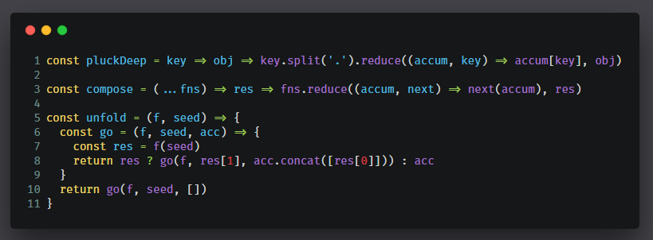

# Carbon from CLI

> Generate beautiful snapshots of coding snippets in seconds

## How to Use ?

* First install the cli tool by `$ npm i -g carbon-cli` once.

* Now use it with `$ carbon -f file.js` where file.js is the file you want the snippet for.
